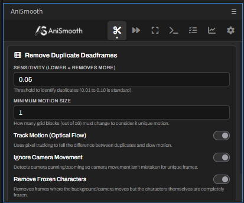
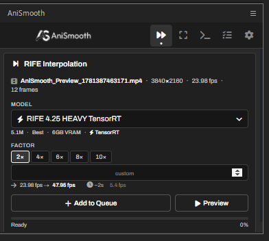
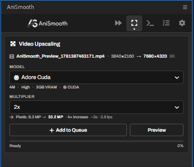
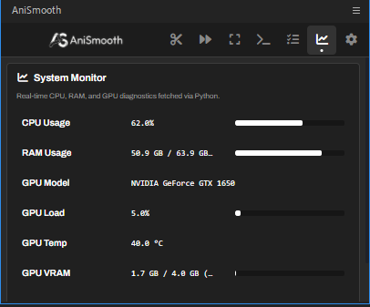
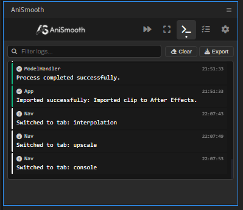
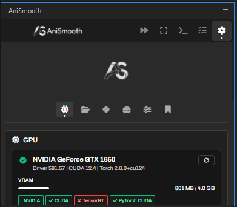
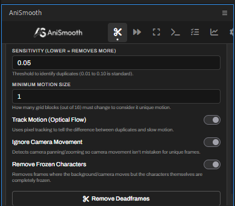

<h1 align="center">
  
  <br />
 </h1>
<p align="center">
  <b>Frame Interpolation & Video Upscaling directly in After Effects.</b><br>
  <i>Remove duplicates, make video smoother, and make clips larger using your graphics card.</i>
</p>

<hr>

## 🎬 About

**AniSmooth** is a free local After Effects extension built to help you remove duplicate frames, make videos smoother with RIFE, and upscale video clips locally on your computer with a Python backend.

Unlike other large and heavy extensions, AniSmooth is built with a **small, clean, and highly compact codebase**. The code is split into simple, organized files to ensure the extension loads instantly and runs smoothly alongside other tools without slowing down After Effects.

> [!NOTE]
> **Compatibility:** Supports **After Effects CC 2018 through CC 2026+** (v15.0+). Windows primary support.

---

## 🚀 Features

### Duplicate Frame Removal



- **Threshold Slider** - Adjust how sensitive the check is for duplicate frames.
- **Motion Tracking** - Tells the difference between slow motion and frozen frames.
- **Frozen Character Detection** - Finds frames where the background moves but characters are completely frozen.

### Frame Interpolation



- **RIFE Models** - Supports RIFE 4.25 models (running on CUDA or TensorRT).
- **Custom Multipliers** - Choose speed multipliers (2x, 4x, 6x, 8x, 10x) or write a custom number up to 64x.

### Video Upscaling



- **Upscaling Multipliers** - Make clips 2x or 4x larger.
- **Model Support** - ShuffleCUGAN models built for anime and detailed clips.

### Flowframes Interpolation

- **Use Your Flowframes Install** - Drives your local [Flowframes](https://nmkd.itch.io/flowframes) app directly from After Effects (point AniSmooth at `Flowframes.exe` in Settings).
- **Engines & Models** - Choose the AI implementation (RIFE NCNN, RIFE NCNN/VS, DAIN NCNN) and RIFE model (up to 4.26), with multipliers from 2x to 16x.
- **Output Encoders** - h264 / h265 / AV1, including NVENC and AMF variants.
- **Hands-off** - The selected layer is pre-rendered, sent to Flowframes, and the finished clip is imported back automatically.

### Batch Queue

- **Queue Everything** - Interpolation, upscaling, deadframe removal, and Flowframes jobs all run through one serial queue.
- **Pre-render on Add** - Each clip is captured from the timeline the moment you add it, so changing your selection or adding more jobs while one runs never grabs the wrong layer.
- **Control** - Pause, resume, cancel, and retry jobs; the queue persists across restarts.

### System & Environment




- **Usage Monitor** - Shows RAM usage, GPU usage, and GPU temperature.
- **Setup Wizard** - Installer checker that helps you download and set up Python, FFmpeg, and model files.

### Settings & Customization




- **GPU Diagnostics** - Shows VRAM usage and your graphics card model.
- **Output Preferences** - Set where files save, customize names, prevent overwriting files, and automatically import completed clips into your composition.
- **Interface Toggles** - Hide tabs you do not use and choose which models, Flowframes engines, and encoders appear in the dropdown lists. The panel opens on the first enabled tab.
- **Collapsible Panels** - Every settings panel collapses to a one-line description so the tab stays compact.
- **Flowframes Path** - Point AniSmooth at your `Flowframes.exe` (auto-detected when installed in the default location).
- **Config Presets** - Save, import, and export your settings (including Flowframes options) to share them or keep backups.

---

## 🧠 Supported Models

AniSmooth supports local hardware-accelerated models for both frame interpolation and video upscaling.

> [!NOTE]
> **Beta Stage:** We plan to add more models in the future. Right now, because the extension is in beta, we are keeping only these selected models—which are currently considered the best ones available—until we make sure the extension is 100% stable.

### 1. Frame Interpolation Models (RIFE 4.25)

| Model Key | Model Name | Parameters | VRAM Required | Engine / Acceleration | Description & Use Case |
| :--- | :--- | :--- | :--- | :--- | :--- |
| `rife4.25` | RIFE 4.25 Cuda | 1.3M | ~2GB | PyTorch CUDA | Fast, lightweight model for quick renders and older graphics cards. |
| `rife4.25-heavy` | RIFE 4.25 HEAVY Cuda | 5.1M | ~6GB | PyTorch CUDA | Larger model that gives the best motion results but needs a stronger graphics card. |
| `rife4.25-tensorrt` | RIFE 4.25 TensorRT | 1.3M | ~2GB | NVIDIA TensorRT | Optimized version that runs up to 1.8x faster on compatible NVIDIA cards. |
| `rife4.25-heavy-tensorrt` | RIFE 4.25 HEAVY TensorRT | 5.1M | ~6GB | NVIDIA TensorRT | The high-quality model optimized to run much faster on NVIDIA cards. |

### 2. Video Upscaling Models

| Model Key | Model Name | Parameters | VRAM Required | Engine / Acceleration | Description & Use Case |
| :--- | :--- | :--- | :--- | :--- | :--- |
| `adore` | Adore Cuda | 4M | ~3GB | PyTorch CUDA | Keeps lines sharp and retains details when upscaling. |
| `fallin_soft` | Fallin Soft Cuda | 3.9M | ~4GB | PyTorch CUDA | Built for anime, making colors smooth, backgrounds clean, and lines look sharp. |

---

## 📦 Installation

### Method 1: ZXP Installer (Easiest)
1. Pick your After Effects version folder (AE2018 / AE2020 / AE2022).
2. Download [ZXP Installer](https://aescripts.com/learn/post/zxp-installer) (Windows & macOS).
3. Drag `AniSmooth_AE2020.zxp` (or corresponding version) onto the ZXP Installer window.
4. Restart After Effects, go to `Window > Extensions > AniSmooth`.

### Method 2: Windows Setup Wizard (.exe)
1. Open your version folder and run `AniSmoothSetup_AE2020.exe`.
2. Follow the setup wizard - it handles file placement and registry keys automatically.

### Method 3: Manual Folder Installation
1. Copy the `AniSmooth` folder from your desired version folder to:
   - Windows: `C:\Program Files (x86)\Common Files\Adobe\CEP\extensions\`
2. Enable PlayerDebugMode: double-click `Add-Keys.reg` or run `Add-Keys.bat` as admin.
3. Restart After Effects.

---

## 🛠️ Building from Source
```bash
cd tools && npm install
cd .. && npm run build:all
```

---

## ⚠️ Usage Notice

This extension runs local Python and AI models on your system. Make sure you meet the VRAM requirements (2GB+ for basic, 6GB+ for heavy models) and have an NVIDIA GPU for CUDA acceleration.
